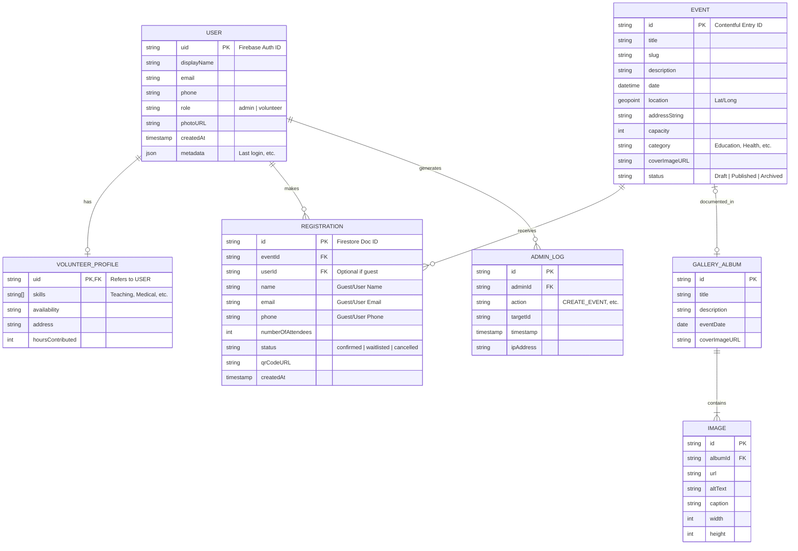

# Entity-Relationship Diagram (ERD)

```mermaid
erDiagram
    %% Entities
    USER {
        string uid PK "Firebase Auth ID"
        string displayName
        string email
        string phone
        string role "admin | volunteer"
        string photoURL
        timestamp createdAt
        json metadata "Last login, etc."
    }

    VOLUNTEER_PROFILE {
        string uid PK, FK "Refers to USER"
        string[] skills "Teaching, Medical, etc."
        string availability
        string address
        int hoursContributed
    }

    EVENT {
        string id PK "Contentful Entry ID"
        string title
        string slug
        string description
        datetime date
        geopoint location "Lat/Long"
        string addressString
        int capacity
        string category "Education, Health, etc."
        string coverImageURL
        string status "Draft | Published | Archived"
    }

    REGISTRATION {
        string id PK "Firestore Doc ID"
        string eventId FK
        string userId FK "Optional if guest"
        string name "Guest/User Name"
        string email "Guest/User Email"
        string phone "Guest/User Phone"
        int numberOfAttendees
        string status "confirmed | waitlisted | cancelled"
        string qrCodeURL
        timestamp createdAt
    }

    GALLERY_ALBUM {
        string id PK
        string title
        string description
        date eventDate
        string coverImageURL
    }

    IMAGE {
        string id PK
        string albumId FK
        string url
        string altText
        string caption
        int width
        int height
    }

    ADMIN_LOG {
        string id PK
        string adminId FK
        string action "CREATE_EVENT, etc."
        string targetId
        timestamp timestamp
        string ipAddress
    }

    %% Relationships
    USER ||--o| VOLUNTEER_PROFILE : "has"
    USER ||--o{ REGISTRATION : "makes"
    EVENT ||--o{ REGISTRATION : "receives"
    USER ||--o{ ADMIN_LOG : "generates"
    
    GALLERY_ALBUM ||--|{ IMAGE : "contains"
    EVENT |o--o| GALLERY_ALBUM : "documented_in"
```
