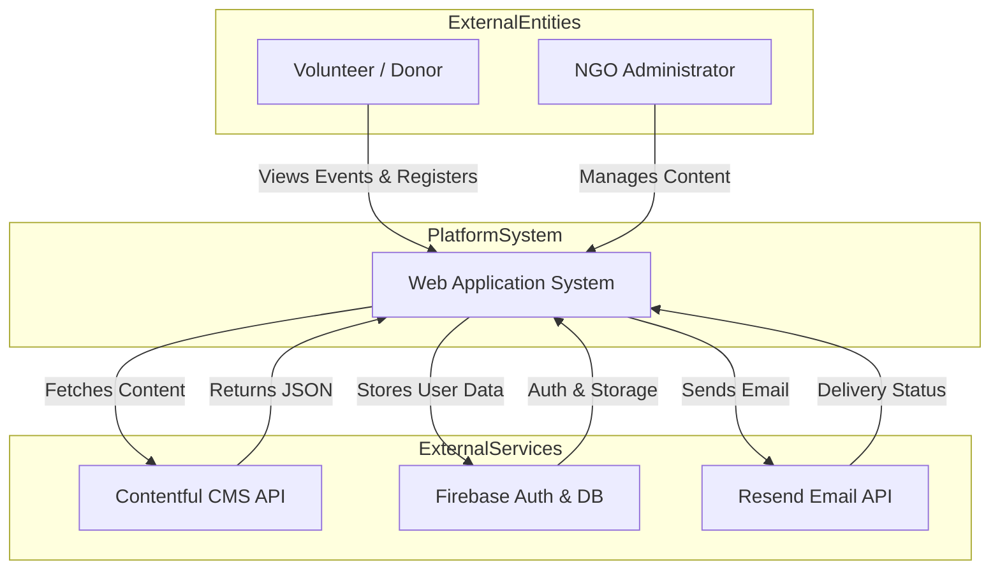

# Lab 1: Project Initiation - Chitkaar Welfare Society Platform

## 1. Software Project Identification

| Attribute | Details |
| :--- | :--- |
| **Project Title** | Chitkaar Welfare Society Platform |
| **Project ID** | CWS-2026-SEP |
| **Domain** | Social Welfare / Non-Governmental Organization (NGO) Management |
| **Project Type** | Web Application (B2C / B2B) & Digital Transformation |
| **Sponsor/Client** | Chitkaar Welfare Society (NGO) |
| **Project Manager** | Aryan Tiwari (RA2311003030171) |
| **Start Date** | January 15, 2026 |
| **Target Delivery** | April 30, 2026 |
| **Estimated Duration** | 16 Weeks (4 Months) |

## 2. Business Case & Feasibility Analysis

### 2.1 Executive Summary
The Chitkaar Welfare Society, a dedicated non-profit organization aiming to uplift underprivileged communities, currently operates using traditional, manual processes. These processes involve decentralized communication (WhatsApp groups), manual data entry (Excel spreadsheets), and a lack of a unified digital presence. This fragmentation limits the NGO's ability to scale its operations, recruit volunteers efficiently, and maintain transparency with donors. 

The proposed **Chitkaar Welfare Society Platform** will serve as a centralization hub, digitizing core operations such as event management, volunteer recruitment, and donor engagement. By implementing this system, the NGO will transition from a disorganized operational model to a streamlined, data-driven digital ecosystem.

### 2.2 Strategic Alignment
This project is directly aligned with the NGO's strategic goal of "Digital Transformation & Global Outreach" for the fiscal year 2026.
*   **Operational Efficiency:** Reducing the man-hours spent on administrative tasks by 60%.
*   **Global Reach:** Establishing a verified digital presence to attract international donors and younger, tech-savvy volunteers.
*   **Transparency:** Providing a real-time "Impact Dashboard" to showcase where funds and efforts are being utilized.

### 2.3 Cost-Benefit Analysis (Detailed)
*   **Tangible Benefits:**
    *   **Volunteer Growth:** Estimated 40% increase in sign-ups due to the removal of friction in the registration process.
    *   **Cost Savings:** Elimination of paper-based marketing (flyers) in favor of digital event sharing.
    *   **Admin Time:** Saving approximately 15 hours/week currently spent on manual coordination.
*   **Intangible Benefits:**
    *   Enhanced brand reputation and credibility.
    *   Improved data security for volunteer information.
    *   Better decision-making through analytics (e.g., identifying which events are most popular).
*   **Estimated Cost:**
    *   **Development:** $0 (Student Project / Pro bono).
    *   **Infrastructure:** $0/month (Leveraging Free Tiers of Vercel, Firebase, and Contentful).
    *   **Maintenance:** Minimal (Self-hosted/Serverless).

## 3. Problem Statement & Solution

### 3.1 The Problem
Chitkaar Welfare Society faces significant operational bottlenecks:
1.  **Decentralized Communication:** Information about upcoming drives (Food, Education, Health) is scattered across various social media channels, leading to missed opportunities for willing volunteers.
2.  **Manual Data Handling:** Registration data is collected on paper or Google Forms and manually transferred to Excel, resulting in data loss, duplication, and privacy concerns.
3.  **Lack of Donor Transparency:** Donors often hesitate to contribute due to a lack of visibility into past events and the actual impact of their donations.
4.  **Inefficient Event Management:** There is no centralized calendar or system to track event capacity, leading to overcrowding or under-attendance.

### 3.2 The Proposed Solution
The solution is a comprehensive, responsive **Web Application** that integrates:
*   **Automated Event Management System:** Allows admins to create, update, and publish events instantly.
*   **Volunteer Management Portal:** Enables seamless sign-up, profile management, and history tracking for volunteers.
*   **Digital Gallery & Impact Showcase:** A dynamic, high-performance media gallery to display proof of work.
*   **Admin Dashboard:** A secure backend interface for managing all data without touching a single line of code.

### 3.3 Success Criteria
*   **Deployment:** Successful launch of the platform on Vercel with a custom domain.
*   **Adoption:** Onboarding of 50+ existing active volunteers within the first week.
*   **Performance:** Achieving a Google Lighthouse performance score of 90+.
*   **Stability:** Zero critical bugs in the event registration flow during the pilot phase.

## 4. System Context Diagram (Level 0 DFD)

The following diagram illustrates the high-level interaction between the System (Chitkaar Platform) and its external entities (Users, Admins, and External APIs).

## 5. Scope of Work

### 5.1 In-Scope
*   **User Module:** Landing Page, About Us, Event Listing, Event Detail, Volunteer Registration Form, Gallery, Contact Us.
*   **Admin Module:** Dashboard login, View Registrations, Export Data (CSV).
*   **CMS Integration:** Contentful setup for Events and Gallery.
*   **Email Automation:** Integration with Resend for confirmation emails.

### 5.2 Out-of-Scope
*   **Payment Gateway:** Direct online monetary transactions are excluded for Phase 1 (UPI QR codes will be displayed statically).
*   **Mobile App:** Native Android/iOS apps are not part of this deliverables (the web app will be PWA-ready).
*   **Chat System:** Real-time chat between volunteers is not included. 
