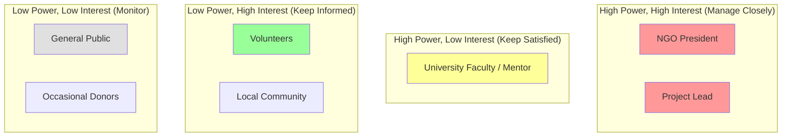
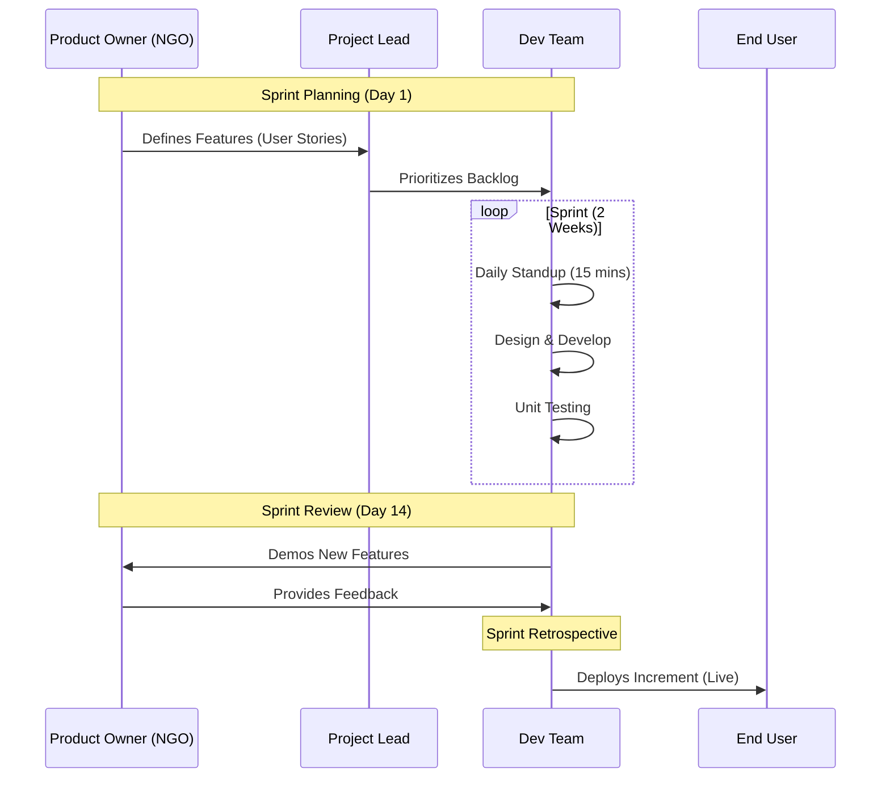

# Lab 2: Stakeholder Analysis & Process Modeling - Chitkaar Platform

## 1. Stakeholder Analysis

### 1.1 Stakeholder Identification & Classification
A stakeholder is any individual or group that can affect or be affected by the outcome of the software project. For the Chitkaar Welfare Society Platform, we have identified the following key stakeholders:

| Stakeholder | Role | Impact | Interest | Influence Strategy |
| :--- | :--- | :--- | :--- | :--- |
| **NGO President** | Client / Sponsor | High | High | **Manage Closely:** Regular demos, requirement validation, and budget approval. |
| **Aryan Tiwari** | Project Lead / Architect | High | High | **Manage Closely:** Oversees technical execution and ensuring milestones are met. |
| **Volunteers** | End Users | Low | High | **Keep Informed:** User acceptance testing (UAT) and feedback surveys. |
| **Donors** | End Users | Medium | Low | **Monitor:** Ensure the platform builds trust; provide transparency reports. |
| **Prateek Dixit** | Backend Developer | High | High | **Keep Satisfied:** Ensure clear API specs and database schema definitions. |
| **Kanishka Narang** | QA / Design Lead | Medium | Medium | **Keep Informed:** Involve in early design reviews to prevent rework. |

### 1.2 Stakeholder Influence Map (Power-Interest Grid)
The following quadrant chart visualizes the stakeholders based on their Power (Ability to influence the project) and Interest (Level of concern in the project's outcome).

## 2. User Personas

To ensure the system is user-centric, we have developed detailed personas representing the primary user groups.

### 2.1 Persona 1: The Frustrated Administrator
*   **Name:** Rahul Verma
*   **Age:** 34
*   **Occupation:** Operations Manager at Chitkaar Welfare Society
*   **Tech Literacy:** Moderate (Uses WhatsApp, Excel, Email)
*   **Goals:**
    *   To centralize all event data in one place.
    *   To stop using multiple Excel sheets that get out of sync.
    *   To easily verify which volunteers actually attended an event.
*   **Frustrations:**
    *   "I hate copy-pasting names from WhatsApp to Excel."
    *   "I lose track of photos sent by volunteers after an event."
    *   "I can't tell donors exactly how many people we helped last month."
*   **Scenario:** Rahul logs into the Admin Dashboard, creates a new "Food Drive" event in 2 minutes, and watches as registrations pour in automatically, without him needing to type a single name.

### 2.2 Persona 2: The Eager Student Volunteer
*   **Name:** Simran Kaur
*   **Age:** 20
*   **Occupation:** B.Tech Student
*   **Tech Literacy:** High (Mobile-first, Social Media native)
*   **Goals:**
    *   To find meaningful volunteering opportunities on weekends.
    *   To get a certificate or proof of her social work for college credits.
    *   To easily sign up without filling out long paper forms.
*   **Frustrations:**
    *   "I never know when the next drive is because I miss the WhatsApp message."
    *   "The registration Google Form is too long and boring."
    *   "I don't know if my registration was accepted."
*   **Scenario:** Simran sees an event link on Instagram, clicks it, lands on the Chitkaar website, taps "Join Now", and instantly receives a confirmation email with a QR code.

### 2.3 Persona 3: The Skeptical Donor
*   **Name:** Mr. Sharma
*   **Age:** 52
*   **Occupation:** Local Business Owner
*   **Tech Literacy:** Low
*   **Goals:**
    *   To ensure his money is actually reaching the needy.
    *   To see photos and reports of past events.
*   **Frustrations:**
    *   "I don't trust NGOs that don't show their work."
    *   "I want to see the impact, not just hear about it."
*   **Scenario:** Mr. Sharma visits the "Gallery" section, sees high-quality photos of the recent food drive, reads a success story, and decides to contact the NGO for a donation.

## 3. Process Model Selection

### 3.1 Selected Methodology: Agile Scrum
We have selected the **Agile Scrum Methodology** for the development of the Chitkaar Platform. This iterative and incremental approach allows us to deliver value early and adapt to changing requirements.

### 3.2 Justification
1.  **Flexibility:** The NGO's requirements may evolve as they see the prototype. Agile allows us to pivot without massive rework.
2.  **Early Delivery:** We can deploy the "Event Registration" module in the first month, allowing the NGO to use it immediately while we build the "Admin Dashboard".
3.  **Risk Management:** Regular sprints (2 weeks) allow us to identify and mitigate risks (like API limits or technical debt) early.

### 3.3 Scrum Process Flow

### 3.4 Sprint Schedule Structure
*   **Sprint 0 (Initiation):** Setup, Feasibility, Architecture Design.
*   **Sprint 1 (Core Features):** Landing Page, Event Listing, Basic Registration.
*   **Sprint 2 (Admin & CMS):** Admin Login, Contentful Integration, Event CRUD.
*   **Sprint 3 (Enhancements):** Gallery, Search, Filters, SEO Optimization.
*   **Sprint 4 (Finalization):** Testing, Bug Fixes, User Documentation, Handover.
