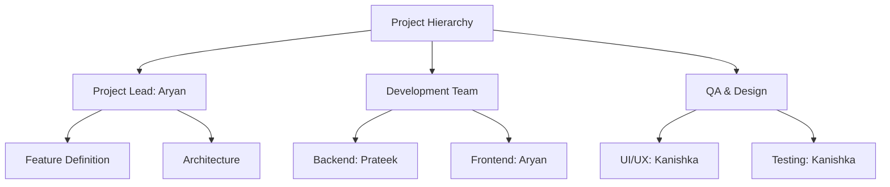
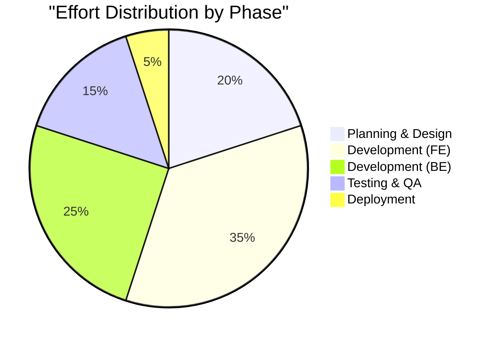

# Lab 4: Project Planning - Chitkaar Platform

## 1. Project Management Approach

The project will be executed using the **Agile Scrum Framework**. This approach is chosen due to the dynamic nature of the requirements and the need for continuous feedback from the NGO stakeholders.

### 1.1 Project Structure
The project is divided into **4 Sprints**, each lasting **2 weeks**. This allows for iterative development, testing, and deployment.

## 2. Team Roles & Responsibilities

| Role | Details | Key Responsibilities |
| :--- | :--- | :--- |
| **Project Lead / Architect** | Aryan Tiwari | - Defines the overall system architecture. - Manages the GitHub repository and CI/CD pipelines. - Leads the daily standups and sprint planning. |
| **Backend Developer** | Prateek Dixit | - Designs the Firebase database schema. - Implements API integrations (Contentful, Resend). - Ensures data security and validation rules. |
| **Frontend Developer** | Aryan Tiwari | - Develops React components using Next.js. - Ensures pixel-perfect implementation of Figma designs. - Optimizes performance (Core Web Vitals). |
| **UI/UX Designer & QA** | Kanishka Narang | - Creates high-fidelity wireframes in Figma. - Conducts manual testing (Black Box Testing). - Verifies mobile responsiveness across devices. |

## 3. Effort Estimation (Function Point Analysis)

We have utilized the **Function Point Analysis (FPA)** method to estimate the size and effort of the project.

### 3.1 Unadjusted Function Points (UFP)
| Function Type | Count | Complexity Weight | Total UFP |
| :--- | :--- | :--- | :--- |
| **External Inputs (EI)** | 4 | 4 (Medium) | 16 |
| **External Outputs (EO)** | 3 | 5 (Medium) | 15 |
| **External Enquiries (EQ)** | 3 | 4 (Medium) | 12 |
| **Internal Logical Files (ILF)** | 2 | 10 (High) | 20 |
| **External Interface Files (EIF)** | 2 | 7 (Medium) | 14 |
| **Total** | | | **77** |

### 3.2 Total Effort Calculation
Based on historical data for student teams (Productivity = 0.5 FP/hour):
*   **Total Function Points:** 77
*   **Estimated Hours:** 77 / 0.5 = **154 Hours**
*   **Buffer (15%):** 23 Hours
*   **Total Planner Effort:** **177 Hours**

## 4. Resource Allocation & Cost Estimation

Although this is a college project with zero budget, we have calculated the **Notional Cost** to demonstrate industry-standard planning.

### 4.1 Cost Breakdown
| Resource | Quantity | Rate (Industry Std) | Duration | Total Cost |
| :--- | :--- | :--- | :--- | :--- |
| **Project Manager** | 1 | $50/hr | 40 hrs | $2,000 |
| **Developers** | 2 | $30/hr | 100 hrs | $3,000 |
| **QA Engineer** | 1 | $25/hr | 37 hrs | $925 |
| **Infrastructure** | - | - | - | $0 (Free Tier) |
| **Software Licenses** | - | - | - | $0 (Open Source) |
| **Total Notional Cost** | | | | **$5,925** |

### 4.2 Resource Usage Chart

## 5. Risk Management Plan
See **Lab 5** for the detailed Risk Register and Mitigation Strategies.

## 6. Software Quality Assurance Plan (SQAP)
*   **Code Reviews:** All Pull Requests (PRs) must be reviewed by the Project Lead before merging.
*   **Linting:** `ESLint` and `Prettier` will be enforced via pre-commit hooks (Husky).
*   **Testing:** Critical flows (Registration) must pass manual regression testing before every release.
