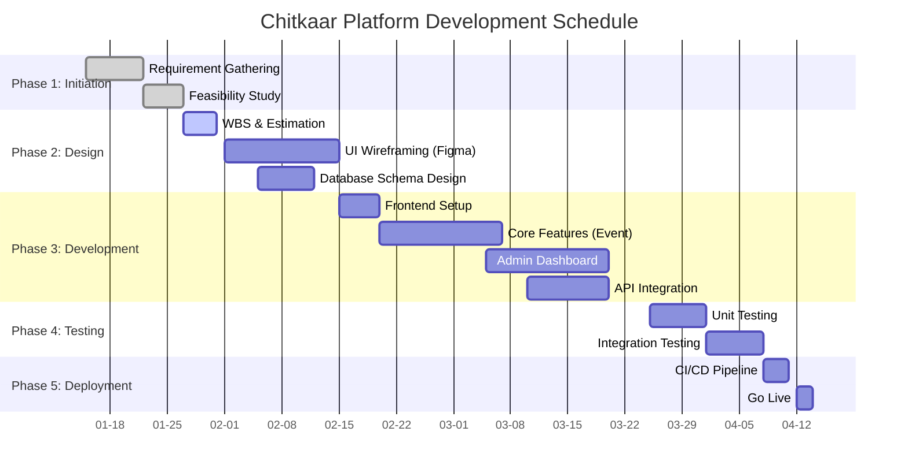
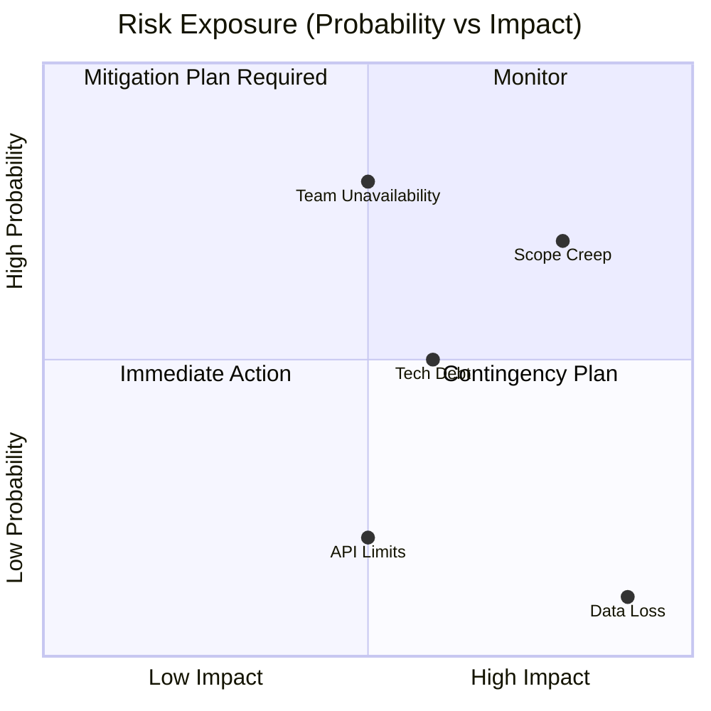

# Lab 5: Work Breakdown Structure (WBS) & Risk Management

## 1. Requirement Analysis & Breakdown

### 1.1 Detailed Work Breakdown Structure (WBS)
The project is decomposed into smaller, manageable components down to Level 4.

*   **1. Project Initiation**
    *   1.1 Project Charter & Stakeholder Analysis
        *   1.1.1 Define Objectives & Scope
        *   1.1.2 Identify Key Stakeholders (President, Donors)
    *   1.2 Feasibility Study
        *   1.2.1 Technical Feasibility (Next.js & Firebase)
        *   1.2.2 Economic Feasibility (Cost-Benefit)

*   **2. System Design & Modeling**
    *   2.1 UI/UX Design
        *   2.1.1 Low-Fidelity Wireframes (Paper Sketches)
        *   2.1.2 High-Fidelity Prototypes (Figma)
        *   2.1.3 Design System (Typography, Colors, Components)
    *   2.2 Architecture Design
        *   2.2.1 Database Schema (NoSQL Collections)
        *   2.2.2 API Endpoint Definition
        *   2.2.3 Security Policies (Role-Based Access)

*   **3. Implementation (Development)**
    *   3.1 Frontend Development
        *   3.1.1 Landing Page (Hero, About, Footer)
        *   3.1.2 Event Listing Page (Cards, Filter Logic)
        *   3.1.3 Event Detail Page (Dynamic Routing)
        *   3.1.4 Registration Form (Validation & API Call)
    *   3.2 Backend Development
        *   3.2.1 Contentful Model Setup (Events, Gallery)
        *   3.2.2 Firebase Function for Registration
        *   3.2.3 Resend Email Integration
    *   3.3 Admin Dashboard
        *   3.3.1 Secure Login (Auth Guard)
        *   3.3.2 View Registrations Table
        *   3.3.3 Export to CSV Feature

*   **4. Testing & QA**
    *   4.1 Functional Testing
        *   4.1.1 Unit Testing (Jest for Utilities)
        *   4.1.2 Integration Testing (API Responses)
    *   4.2 Non-Functional Testing
        *   4.2.1 Performance Testing (Lighthouse)
        *   4.2.2 Security Auditing (OWASP Checks)

*   **5. Deployment & Handover**
    *   5.1 Deployment
        *   5.1.1 Vercel Environment Config
        *   5.1.2 Domain DNS Setup
    *   5.2 Documentation
        *   5.2.1 User Manual
        *   5.2.2 Technical Documentation

## 2. Project Schedule (Gantt Chart)

The following Gantt chart illustrates the timeline for the 16-week project duration.

## 3. Risk Management

### 3.1 Risk Register

| ID | Risk Description | Probability | Impact | Severity | Mitigation Strategy | Owner |
| :--- | :--- | :--- | :--- | :--- | :--- | :--- |
| **R1** | **Scope Creep:** Stakeholders adding new features (e.g., Payment Gateway) mid-sprint. | High (0.7) | High (0.8) | **Critical** | strict change control process. "Must-haves" vs "Nice-to-haves". | Project Lead |
| **R2** | **Technical Debt:** Team unfamiliar with Next.js 16 App Router features. | Medium (0.5) | Medium (0.6) | **Moderate** | allocate 1 week for "Spike" (Learning & Prototyping) before core dev. | Tech Lead |
| **R3** | **API Rate Limits:** Contentful Free Tier limits (2M API calls). | Low (0.2) | Medium (0.5) | **Low** | Implement aggressive caching (ISR / SSG) to minimize API hits. | Backend Dev |
| **R4** | **Data Loss:** Firebase Firestore misconfiguration or accidental deletion. | Low (0.1) | Critical (0.9) | **Moderate** | Enable daily backups. Use separate "Dev" and "Prod" environments. | Backend Dev |
| **R5** | **Team Unavailability:** Exams or Assignments clashing with Sprint deliverables. | High (0.8) | Medium (0.5) | **High** | Plan "Blackout Periods" in the Gantt chart around exam dates. | Project Manager |

### 3.2 Risk Exposure Matrix

