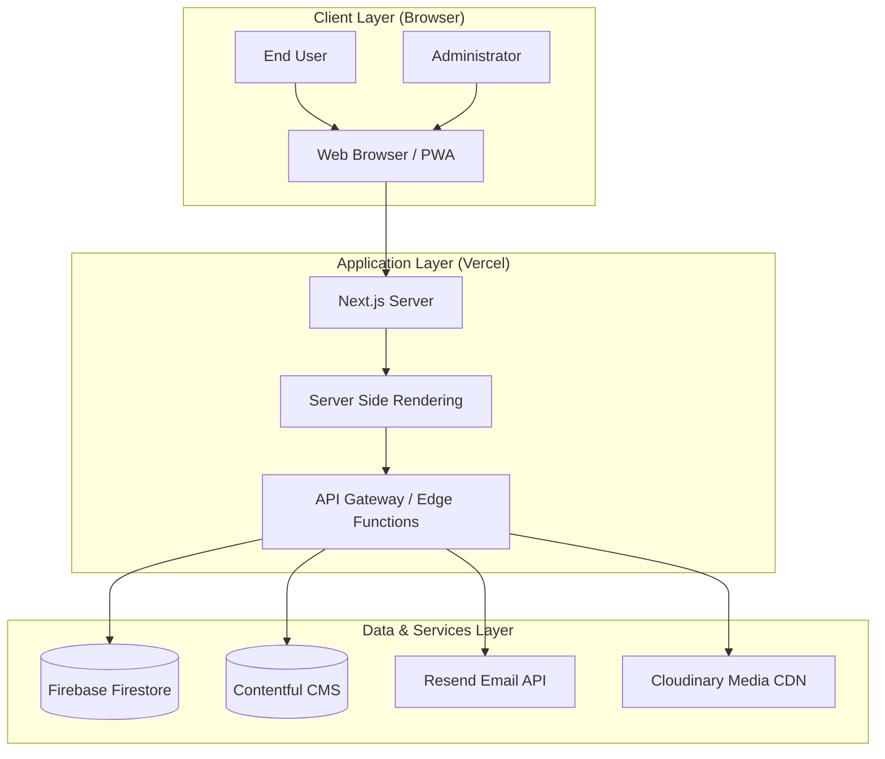
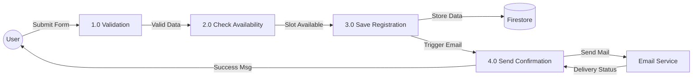
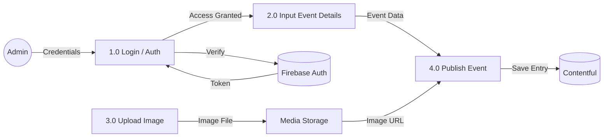

# Lab 6: System Design & Architecture

## 1. Architectural Design

### 1.1 Architectural Pattern
The Chitkaar Welfare Society ecosystem is built on a **Serverless, Component-Based Architecture**. This modern approach allows us to decouple the frontend from the backend services, ensuring scalability and reducing maintenance overhead.

*   **Frontend:** Built with **Next.js** (React Framework), following the Atomic Design methodology for components.
*   **Backend:** Leverages **Next.js API Routes** (Serverless Functions) acting as the middleware between the client and third-party services.
*   **Database:** **Firebase Firestore** (NoSQL) for user data and **Contentful** (Headless CMS) for content data.

### 1.2 High-Level Architecture Diagram (HLD)

## 2. Data Flow Design

### 2.1 Context Diagram (DFD Level 0)
See **Lab 1: Section 4** for the System Context Diagram.

### 2.2 DFD Level 1: Event Registration Process
This diagram details the flow of data when a user registers for an event.

### 2.3 DFD Level 1: Admin Event Management
This diagram details how an admin creates and publishes a new event.

## 3. Technology Stack Justification

| component | Technology | Justification |
| :--- | :--- | :--- |
| **Frontend Framework** | **Next.js 14** | Best-in-class SEO capabilities (critical for an NGO), vast ecosystem, and hybrid rendering (SSR/SSG). |
| **Styling** | **Tailwind CSS** | Utility-first approach speeds up development and ensures consistent design tokens. |
| **Database** | **Firebase** | Real-time capabilities, generous free tier, and easy integration with Google Auth. |
| **CMS** | **Contentful** | strictly separated content from code, allowing non-technical admins to update the site. |
| **Hosting** | **Vercel** | Native support for Next.js, zero-config deployment, and global Edge Network. |
