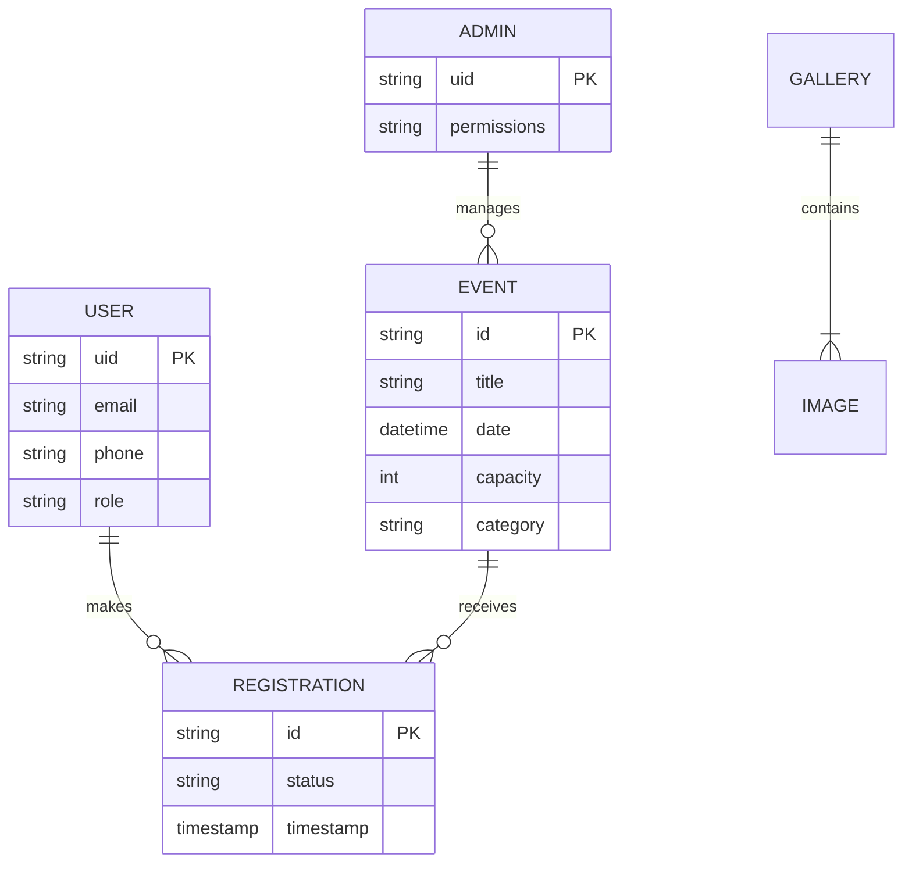
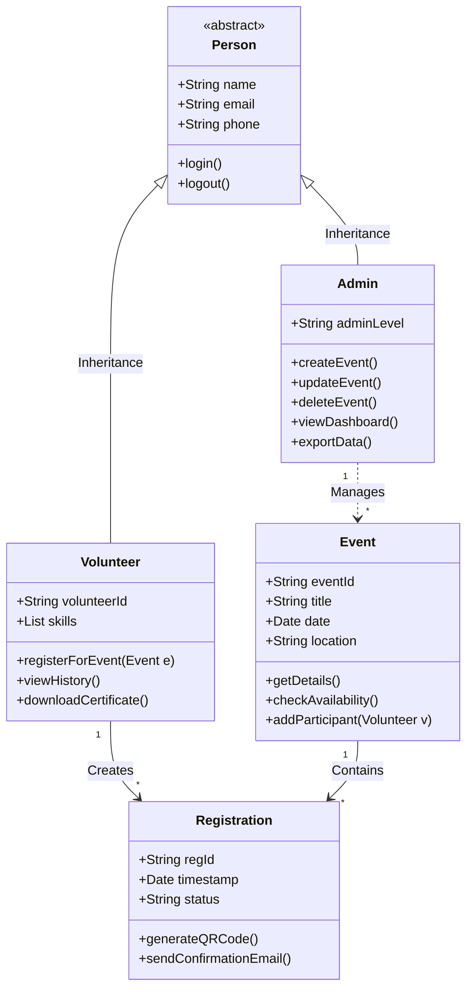

# Lab 7: Data Modeling & Class Design

## 1. Database Design (Cloud Firestore)

### 1.1 Schema Design (NoSQL)
Unlike traditional relational databases, Firestore uses a document-oriented structure. However, for the purpose of conceptual understanding, we define the schemas as Collections and Documents.

#### Collection: `users`
| Field | Type | Description |
| :--- | :--- | :--- |
| `uid` | String (PK) | Unique User ID from Firebase Auth |
| `displayName` | String | Full Name of the user |
| `email` | String | Email Address (indexed) |
| `role` | String | 'admin' or 'volunteer' |
| `createdAt` | Timestamp | Account creation date |

#### Collection: `events` (Synced from Contentful)
| Field | Type | Description |
| :--- | :--- | :--- |
| `id` | String (PK) | Contentful Entry ID |
| `title` | String | Event Title |
| `slug` | String | URL-friendly slug |
| `date` | ISO String | Date and Time of event |
| `location` | GeoPoint | Latitude/Longitude or Address String |
| `capacity` | Number | Maximum allowed participants |

#### Collection: `registrations`
| Field | Type | Description |
| :--- | :--- | :--- |
| `id` | String (PK) | Auto-generated ID |
| `eventId` | String (FK) | Reference to `events` collection |
| `userId` | String (FK) | Reference to `users` collection |
| `status` | String | 'confirmed', 'waitlisted', 'cancelled' |
| `qrCode` | String | URL to generated QR code image |

### 1.2 Entity-Relationship Diagram (ERD)

The following ERD represents the logical relationships between the entities in our system. Note that in a NoSQL environment, these relationships are often denormalized for performance.

## 2. Object-Oriented Design

### 2.1 Class Diagram
The Class Diagram describes the static structure of the system, identifying the classes, their attributes, and operations.

## 3. Data Dictionary
| Data Element | Type | Length | Format | Description |
| :--- | :--- | :--- | :--- | :--- |
| `User_Email` | String | 100 | RFC 5322 | Valid email address for login and notifications. |
| `Event_Date` | Date | - | ISO 8601 | Future date validation required. |
| `Phone_Num` | String | 10 | RegEx `^[0-9]{10}$` | Indian mobile number validation. |
