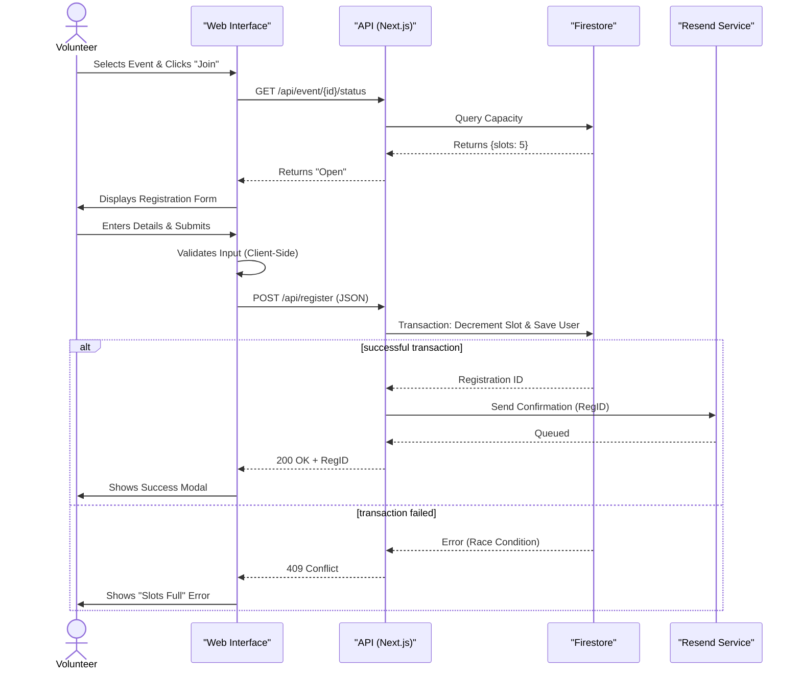
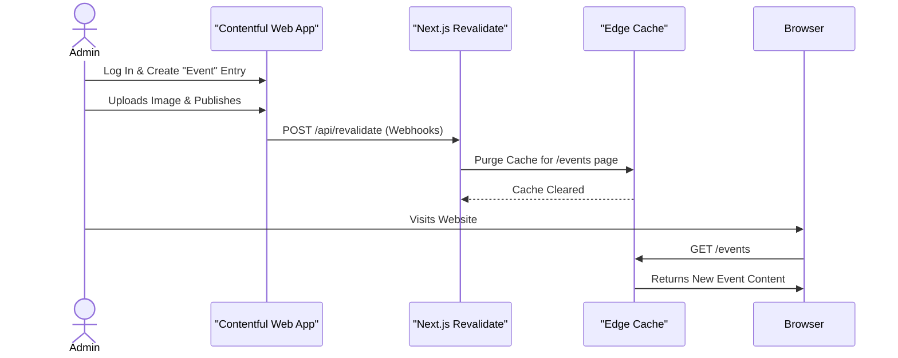
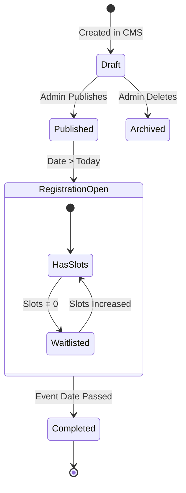
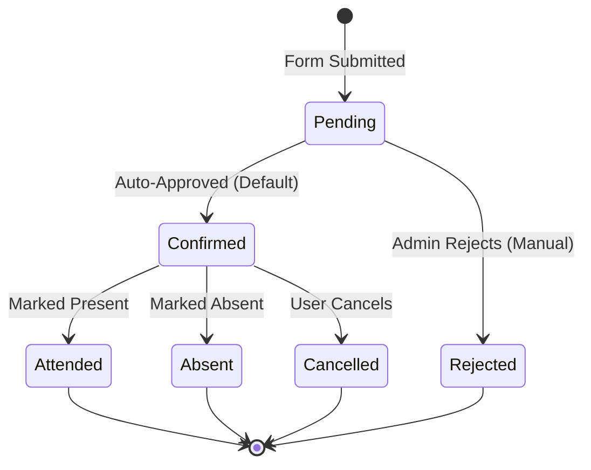

# Lab 8: Behavioral Modeling

## 1. Sequence Diagrams

### 1.1 Sequence Diagram: Volunteer Registration
This diagram captures the dynamic interaction between objects during the registration process.



### 1.2 Sequence Diagram: Admin Event Creation



## 2. Activity Diagrams

### 2.1 Activity Diagram: User Registration Flow
Models the procedural flow of logic for a user trying to register.

```mermaid
graph TD
    Start((Start)) --> ViewList[View Event List]
    ViewList --> SelectEvent[Select Event]
    SelectEvent --> CheckSlots{Slots Available?}
    
    CheckSlots -- No --> ShowFull[Display "Event Full"]
    ShowFull --> ViewList
    
    CheckSlots -- Yes --> ClickJoin[Click "Join Now"]
    ClickJoin --> FillForm[Fill Registration Form]
    FillForm --> Validate{Valid Input?}
    
    Validate -- No --> ShowError[Show Validation Error]
    ShowError --> FillForm
    
    Validate -- Yes --> SubmitAPI[Submit to API]
    SubmitAPI --> DBSave{Database Write?}
    
    DBSave -- Success --> SendEmail[Trigger Email]
    SendEmail --> ShowSuccess[Display Ticket]
    ShowSuccess --> End((End))
    
    DBSave -- Fail --> APIError[Show System Error]
    APIError --> End
```

## 3. State Chart Diagrams

### 3.1 State Diagram: Event Lifecycle
Describes the various states an event can be in during its lifecycle.



### 3.2 State Diagram: Registration Status
Describes the status of a volunteer's application.


