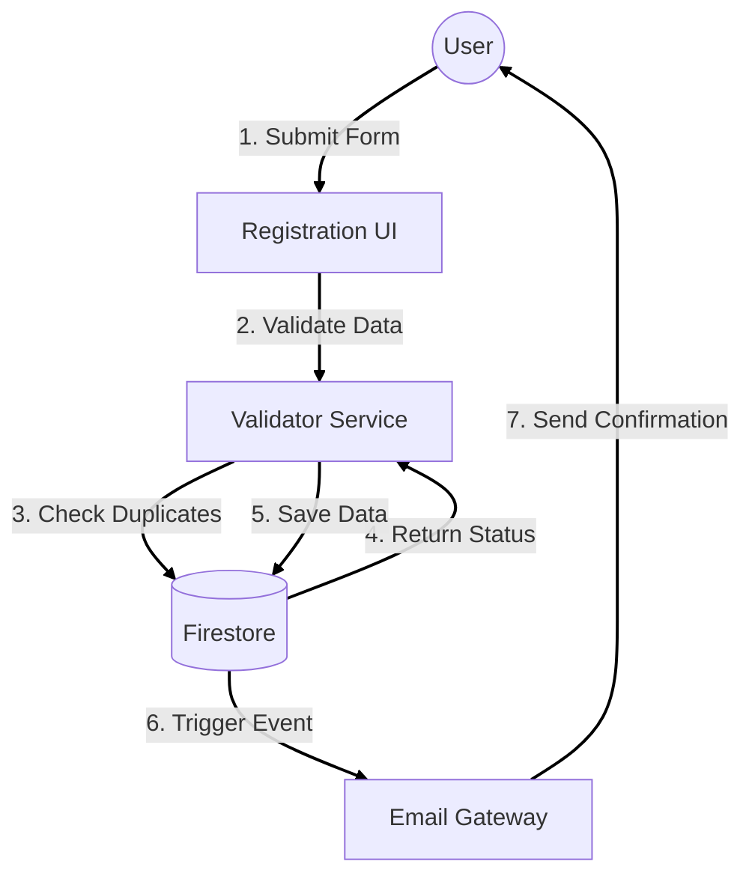

# Lab 9: Interaction & Deployment Modeling

## 1. Interaction Diagrams

### 1.1 Collaboration Diagram: Event Registration
This diagram illustrates the structural relationship and message flow between objects involved in the "Register for Event" use case.



## 2. Component Diagram

The Component Diagram breaks down the system into high-level software components and their dependencies.

```mermaid
componentDiagram
    package "Client Application" {
        [Pages (Next.js)] 
        [Shared Components]
        [Hooks]
    }

    package "Server-Side Functions" {
        [API Routes]
        [Middleware]
    }

    package "External APIs" {
        [Contentful SDK]
        [Firebase Admin SDK]
        [Resend SDK]
    }

    [Pages (Next.js)] --> [Shared Components]
    [Pages (Next.js)] --> [Hooks]
    [Hooks] --> [API Routes] : Fetch Data
    
    [API Routes] --> [Middleware] : Auth Check
    [API Routes] --> [Contentful SDK] : Get Content
    [API Routes] --> [Firebase Admin SDK] : CRUD User Data
```

## 3. Deployment Diagram

The Deployment Diagram visualizes the physical hardware and software execution environments.

### 3.1 Architecture Overview
The system is deployed on a Serverless Infrastructure provided by Vercel, utilizing Edge computing for low latency.

```mermaid
graph TD
    subgraph "Client Device"
        Browser[Web Browser]
        Mobile[Mobile Device]
    end

    subgraph "Vercel Cloud Platform"
        CDN[Edge Network (CDN)]
        Function[Serverless Functions (Node.js 18)]
    end

    subgraph "Database & Storage"
        Firestore[(Google Firestore)]
        Storage[(Cloudinary Media)]
    end

    subgraph "Third Party Services"
        Contentful[Contentful CMS API]
        Resend[Resend Mail API]
    end

    Browser -- "HTTPS/TLS 1.3" --> CDN
    Mobile -- "HTTPS/TLS 1.3" --> CDN
    
    CDN -- "Cache Miss" --> Function
    
    Function -- "gRPC" --> Firestore
    Function -- "REST" --> Contentful
    Function -- "REST" --> Resend
    
    CDN -- "Asset Request" --> Storage
```

### 3.2 Deployment Strategy
*   **Continuous Integration (CI):** Every push to the `main` branch on GitHub triggers a build on Vercel.
*   **Preview Environments:** Pull Requests generate a unique preview URL for testing before merging.
*   **Production:** The `main` branch is automatically deployed to `chitkaar config.com` (or similar).
