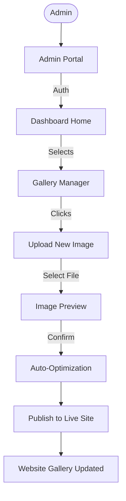

# Lab 10: User Interface Design & UX Flow

## 1. Design System

### 1.1 Color Palette
The color scheme is chosen to evoke trust, calmness, and professionalism, aligning with the NGO's mission.

| Color Name | Hex Code | Usage |
| :--- | :--- | :--- |
| **Trust Blue** | `#00509d` | Primary Buttons, Headers, Links |
| **Calm Cyan** | `#00a8e8` | Accents, Hover States, Icons |
| **Pure White** | `#ffffff` | Backgrounds, Card Surface |
| **Slate Gray** | `#334155` | Body Text, Secondary Headers |
| **Success Green** | `#10b981` | Success Messages, Validations |
| **Error Red** | `#ef4444` | Form Errors, Deletions |

### 1.2 Typography
*   **Primary Font:** `Outfit` (Sans-serif) - Used for Headings (H1-H6). Modern and approachable.
*   **Secondary Font:** `Inter` (Sans-serif) - Used for Body Text. Highly readable at small sizes.

## 2. User Flow Diagrams

### 2.1 User Journey: Event Registration
This flow maps the user's path from landing on the site to successfully registering.

```mermaid
graph TD
    User([User]) --> Home[Home Page]
    Home -->|Scrolls| Events[Featured Events]
    Events -->|Clicks Card| Detail[Event Detail Page]
    
    Detail -->|Reads Info| Decision{Interested?}
    Decision -- No --> Home
    Decision -- Yes --> Register[Click "Join Now"]
    
    Register --> Form[Registration Modal]
    Form -->|Enters Data| Validation{Data Valid?}
    
    Validation -- No --> Error[Show Error Message]
    Error --> Form
    
    Validation -- Yes --> API[Submit to Server]
    API -->|Success| Confirmation[Success Screen]
    
    Confirmation -->|Check Email| Email[Confirmation Email]
    Confirmation --> Home
```

### 2.2 User Journey: Admin Content Management
This flow maps how an admin updates the gallery.



## 3. Screen Descriptions (Wireframes)

### 3.1 Landing Page
*   **Header:** Sticky navbar with Logo (Left) and Links (Home, About, Events, Gallery, Contact) on the right. "Donate" button in primary color.
*   **Hero Section:** Full-width background image of a recent drive with a compassionate headline ("Join Hands to Heal") and a CTA ("Become a Volunteer").
*   **Mission Section:** 3-column grid showing "Education", "Health", and "Food" initiatives with icons.
*   **Footer:** Sitemap, Social Media Links, and Copyright info.

### 3.2 Event Detail Page
*   **Layout:** Two-column layout on Desktop.
    *   **Left Column:** Large Event Image, Title, Description, and Schedule (Date/Time).
    *   **Right Column (Sticky):** "Join Now" card with capacity indicator ("5 spots left") and the Registration Form.
*   **Responsiveness:** Stacks vertically on Mobile with the "Join Now" button fixed at the bottom.

### 3.3 Dashboard (Admin)
*   **Sidebar:** Navigation menu (Events, Volunteers, Gallery, Settings).
*   **Main Area:** Data Table showing recent registrations with Status badges (Green for Confirmed, Yellow for Pending).
*   **Actions:** "Export CSV" button at the top right.
