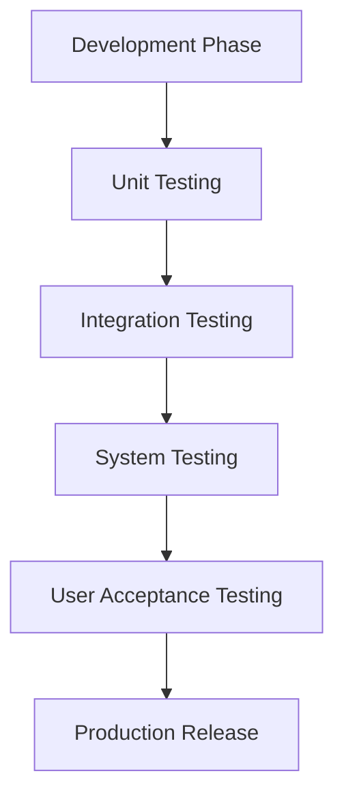

# Lab 12: Software Testing Plan

## 1. Testing Strategy
The testing strategy for the Chitkaar Platform involves a multi-layered approach to ensure functionality, usability, and performance.

### 1.1 Types of Testing
*   **Unit Testing:** Verifying individual components (e.g., `EventCard`, `Button`) in isolation using Jest.
*   **Integration Testing:** ensuring that different modules (e.g., Registration Form + Firebase API) work together.
*   **System Testing:** End-to-end testing of complete user flows (Registration, Admin Login).
*   **Acceptance Testing:** Verification by the NGO President against business requirements.

## 2. Test Environment
*   **Device Coverage:**
    *   **Desktop:** Chrome (Latest), Firefox, Safari.
    *   **Mobile:** iPhone 14 (Safari), Pixel 7 (Chrome).
*   **Tools:**
    *   **Automation:** Jest, React Testing Library.
    *   **Manual:** BrowserStack (for cross-browser compatibility).
    *   **Performance:** Google Lighthouse.

## 3. Test Cases (Functional)

| Test ID | Module | Scenario | Pre-Condition | Steps to Reproduce | Expected Result | Priority |
| :--- | :--- | :--- | :--- | :--- | :--- | :--- |
| **TC-01** | **Auth** | Admin Login with valid credentials | Admin is logged out | 1. Go to `/admin/login` 2. Enter Email/Pass 3. Click "Login" | Redirect to Dashboard | High |
| **TC-02** | **Auth** | Admin Login with invalid credentials | Admin is logged out | 1. Go to `/admin/login` 2. Enter wrong Pass 3. Click "Login" | Show "Invalid Credentials" error | High |
| **TC-03** | **Event** | Volunteer Registration (Happy Path) | Event has slots | 1. Open Event Page 2. Click "Join" 3. Fill Valid Data 4. Submit | Success Message + Email Sent | Critical |
| **TC-04** | **Event** | Volunteer Registration (Duplicate) | User already registered | 1. Open Event Page 2. Fill same email 3. Submit | Show "Already Registered" error | Medium |
| **TC-05** | **Event** | Volunteer Registration (Event Full) | Event capacity = 0 | 1. Open Event Page | "Join" button disabled or shows "Full" | Medium |
| **TC-06** | **Gallery** | Image Lightbox | Gallery has images | 1. Click on an image thumbnail | Image opens in full-screen modal | Low |

## 4. Test Cases (Non-Functional)

| Test ID | Category | Scenario | Metrics/Criteria | Tool |
| :--- | :--- | :--- | :--- | :--- |
| **NFR-01** | Performance | Landing Page Load Time | FCP < 1.5s, LCP < 2.5s | Lighthouse |
| **NFR-02** | Responsiveness | Mobile Viewport Layout | No horizontal scroll on 320px width | DevTools |
| **NFR-03** | Security | SQL Injection / XSS | Input fields sanitize HTML tags | Manual |
