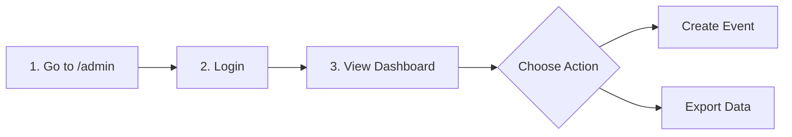

# Lab 14: User Manual & Final Costing

## 1. User Manual: For Volunteers

### 1.1 Getting Started
Welcome to the Chitkaar Welfare Society Platform! This guide will help you find events and sign up as a volunteer.

### 1.2 Steps to Register
1.  **Navigate to Events:** Click on the "Events" tab in the top navigation bar.
2.  **Select an Event:** Browse through the cards (e.g., "Food Drive", "Education Camp"). Click on the image to see more details.
3.  **Check Availability:** Ensure the "Spots Left" counter > 0.
4.  **Fill the Form:** Click the blue **"Join Now"** button. A popup form will appear. Enter your Name, Email, and Phone.
5.  **Submit:** Click "Register". You will see a green success message.
6.  **Confirmation:** Check your email inbox for a confirmation ticket with a QR code.

## 2. User Manual: For Administrators

### 2.1 Accessing the Dashboard
The Admin Dashboard is the control center for the platform.

### 2.2 Managing Events
1.  **Login:** Go to `https://chitkaar.org/admin` and enter your secure credentials.
2.  **Create New Event:**
    *   Click the **"New Event"** button on the top right.
    *   Enter the Title, Date (must be future), Location, and Description.
    *   Upload a high-quality cover image (Max 2MB).
    *   Click **"Publish"**. The event is now live on the website.
3.  **View Registrations:**
    *   Click on an Event Name in the list.
    *   You will see a table of all registered volunteers.
4.  **Export Data:**
    *   Click the **"Download CSV"** button to get a spreadsheet for attendance tracking.

## 3. Final Cost Compilation

### 3.1 Development Costs (Notional)
As detailed in Lab 4, the estimated development cost is **$5,925** (based on 177 man-hours).

### 3.2 Operational Costs (Projected Annual)
Since we are utilizing Free Tiers for the pilot phase, the running cost is $0. However, for scaling to 10,000 users, we project the following:

| Service | Free Tier Limit | Projected Cost (Scale) |
| :--- | :--- | :--- |
| **Vercel Pro** | Personal Use | $20/month/member |
| **Contentful** | 2M API calls | $300/month (Team Plan) |
| **Firebase** | 50k reads/day | Pay-as-you-go (~$50/mo) |
| **Domain Name** | - | $12/year |
| **Total Annual** | **$0** | **~$4,500/year** |

### 3.3 Return on Investment (ROI)
*   **Efficiency:** 60% reduction in admin time = Saving ~$500/month in effective salary hours.
*   **Fundraising:** Increased donor trust expected to boost donations by 20%.
