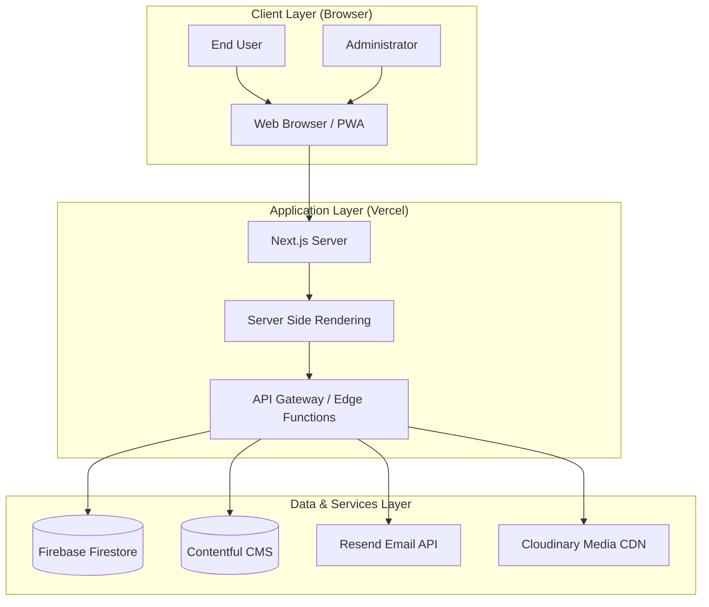

# System Architecture Diagram

```mermaid
graph TD
    subgraph "Client Layer (Browser)"
        User[End User]
        Admin[Administrator]
        Browser[Web Browser / PWA]
    end

    subgraph "Application Layer (Vercel)"
        NextJS[Next.js Server]
        API[API Gateway / Edge Functions]
        SSR[Server Side Rendering]
    end

    subgraph "Data & Services Layer"
        Firebase[(Firebase Firestore)]
        Contentful[(Contentful CMS)]
        Resend[Resend Email API]
        Cloudinary[Cloudinary Media CDN]
    end

    User --> Browser
    Admin --> Browser
    Browser --> NextJS
    NextJS --> SSR
    SSR --> API
    
    API --> Firebase
    API --> Contentful
    API --> Resend
    API --> Cloudinary
```
