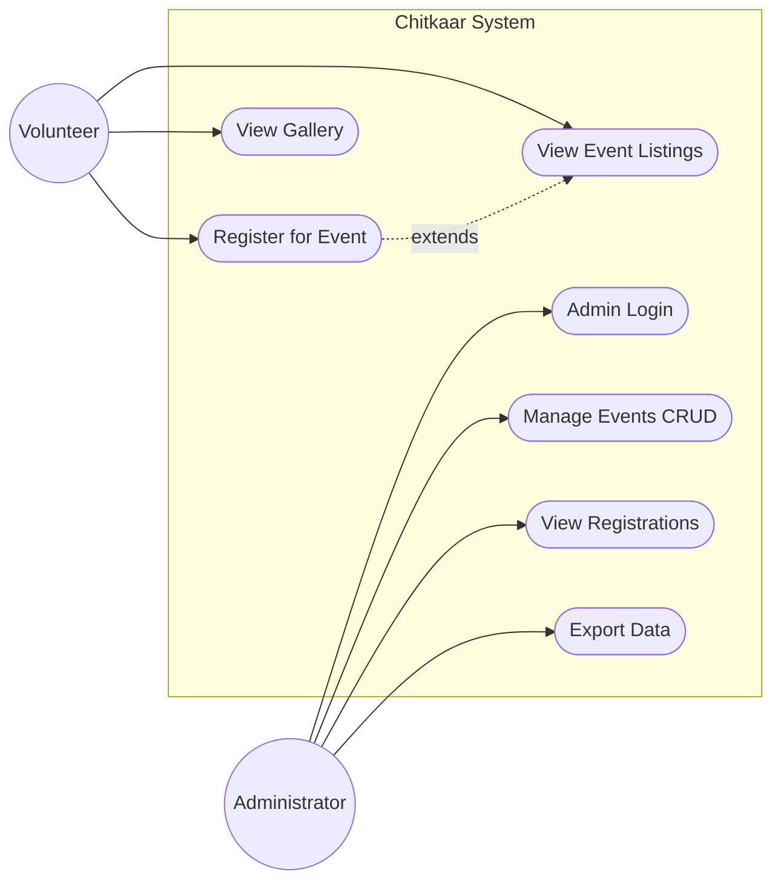

# Use Case Diagram

```mermaid
graph LR
    subgraph "Chitkaar System"
        UC1([View Event Listings])
        UC2([Register for Event])
        UC3([View Gallery])
        UC4([Admin Login])
        UC5([Manage Events CRUD])
        UC6([View Registrations])
        UC7([Export Data])
    end

    V((Volunteer))
    A((Administrator))

    V --> UC1
    V --> UC2
    V --> UC3
    
    A --> UC4
    A --> UC5
    A --> UC6
    A --> UC7
    
    UC2 -.-> |extends| UC1
```
