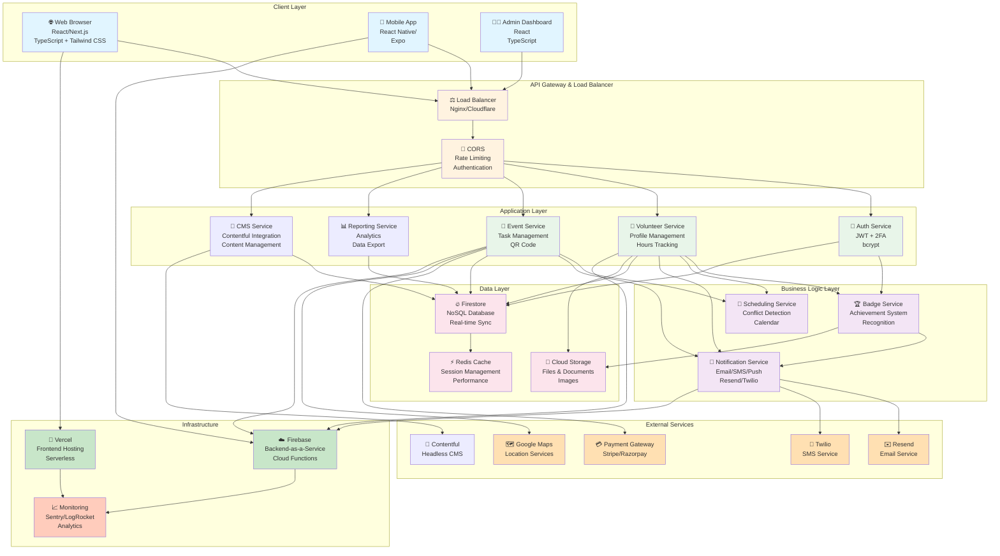
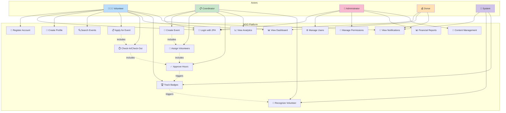
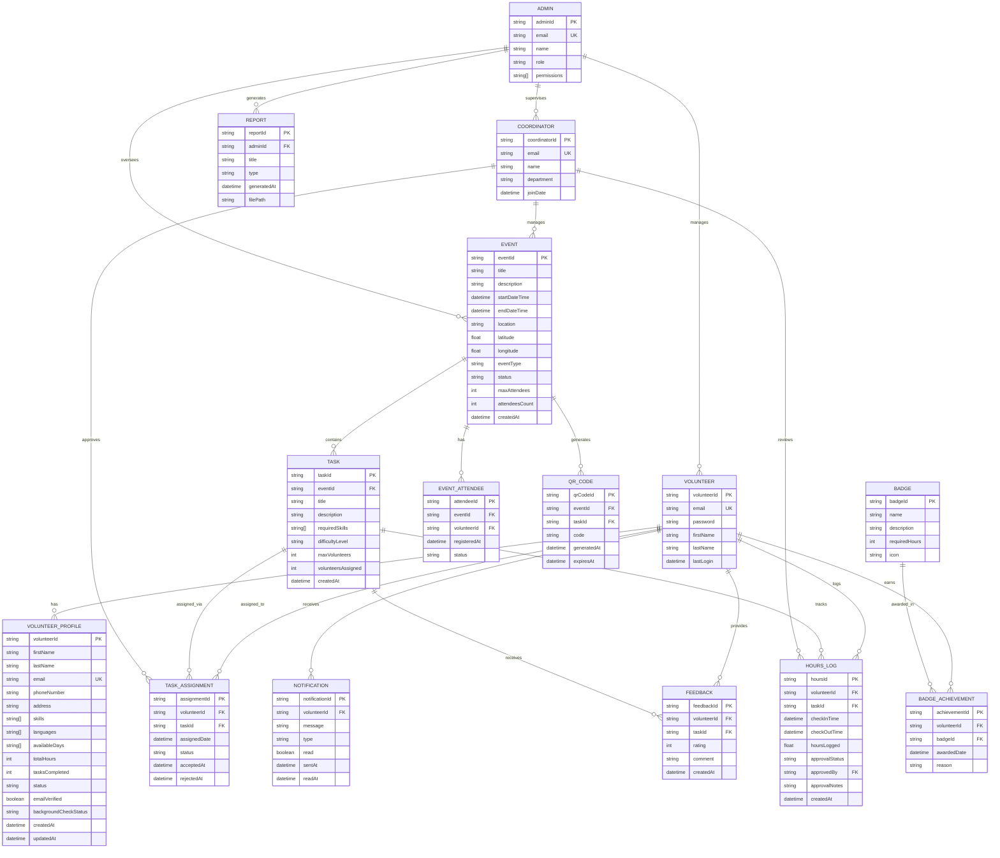
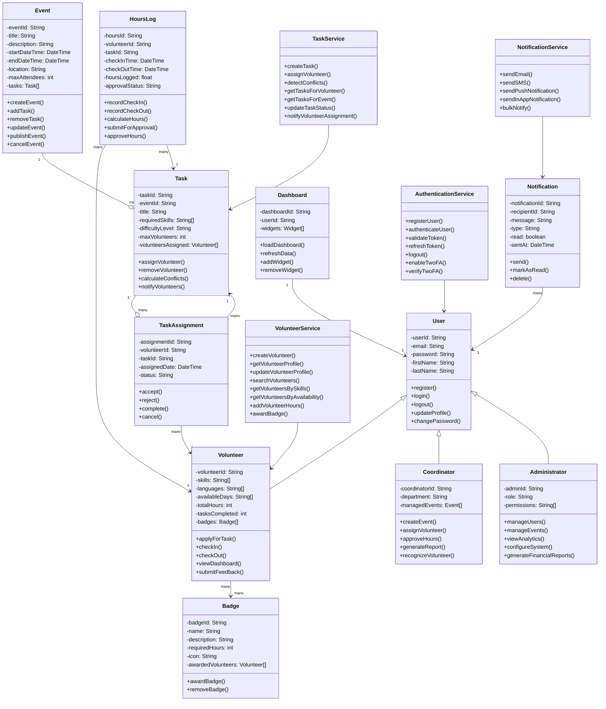
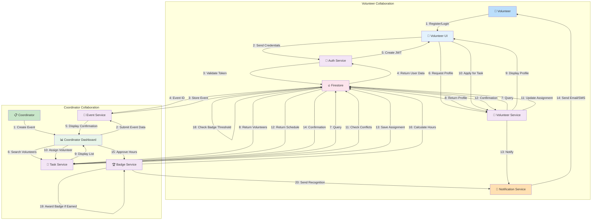
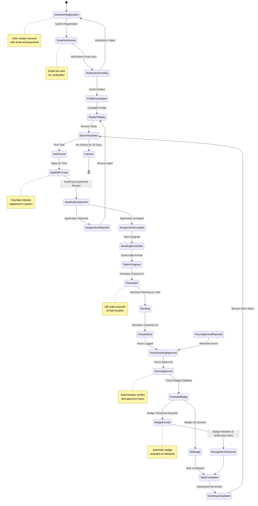
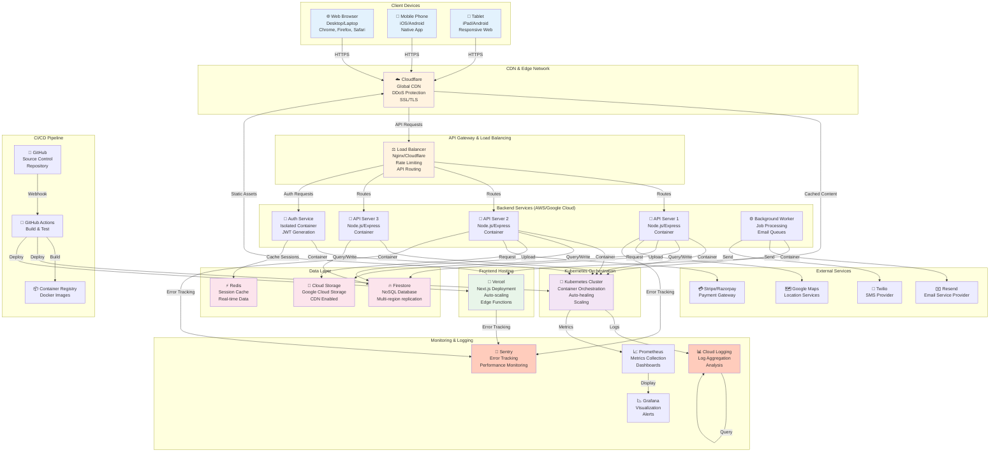

# DIAGRAMS & ARCHITECTURE DOCUMENTATION

## NGO Platform - Visual System Design

This document contains comprehensive Mermaid diagram code for the Chitkaar Welfare Society NGO Web Management Platform. All diagrams can be rendered in Markdown-compatible viewers (GitHub, GitLab, Notion, etc.).

---

## 1. SYSTEM ARCHITECTURE DIAGRAM



---

## 2. USE CASE DIAGRAM



---

## 3. ENTITY-RELATIONSHIP DIAGRAM (ER Diagram)



---

## 4. CLASS DIAGRAM



---

## 5. COLLABORATION DIAGRAM



---

## 6. STATE DIAGRAM



---

## 7. SEQUENCE DIAGRAM

```mermaid
sequenceDiagram
    actor V as Volunteer
    participant WEB as Web App
    participant API as API Server
    participant AUTH as Auth Service
    participant FS as Firestore
    participant NOTIFY as Notification Service
    participant EMAIL as Email Service

    rect rgb(200, 220, 255)
        note over V,EMAIL: Volunteer Registration & Onboarding Flow
        V->>WEB: Navigate to Registration
        WEB->>WEB: Display Registration Form
        V->>WEB: Enter Details (Name, Email, Skills, Availability)
        WEB->>API: POST /auth/register
        API->>AUTH: Validate Email & Password
        AUTH->>AUTH: Hash Password with bcrypt
        AUTH->>FS: Check if Email Exists
        FS-->>AUTH: Email Available
        API->>FS: Create Volunteer Document
        FS-->>API: Document Created (volunteerId)
        API->>NOTIFY: Queue Verification Email
        NOTIFY->>EMAIL: Send Email
        EMAIL-->>V: Verification Link Email
        API-->>WEB: Return Success Message
        WEB-->>V: Show Success & Redirect to Login
    end

    rect rgb(200, 255, 200)
        note over V,EMAIL: Email Verification
        V->>EMAIL: Click Verification Link
        EMAIL->>API: GET /auth/verify?token=XXX
        API->>AUTH: Validate Token
        AUTH->>FS: Update emailVerified = true
        FS-->>AUTH: Updated
        API-->>V: Redirect to Login
        WEB->>WEB: Show Login Page
    end

    rect rgb(255, 220, 200)
        note over V,EMAIL: Login with 2FA
        V->>WEB: Enter Email & Password
        WEB->>API: POST /auth/login
        API->>AUTH: Authenticate Credentials
        AUTH->>FS: Query User Record
        FS-->>AUTH: User Found
        AUTH->>AUTH: Verify Password Hash
        AUTH->>NOTIFY: Generate & Queue 2FA Code
        NOTIFY->>EMAIL: Send 2FA Code via SMS/Email
        EMAIL-->>V: 2FA Code Received
        API-->>WEB: Prompt for 2FA Code
        WEB-->>V: Show 2FA Input Field
        V->>WEB: Enter 2FA Code
        WEB->>API: POST /auth/verify-2fa
        API->>AUTH: Validate 2FA Code
        AUTH->>AUTH: Generate JWT Token
        API->>FS: Create Session Record
        FS-->>API: Session Created
        API-->>WEB: Return JWT & Refresh Token
        WEB->>WEB: Store Tokens in localStorage
        WEB-->>V: Redirect to Dashboard
    end

    rect rgb(220, 200, 255)
        note over V,EMAIL: Task Application Flow
        V->>WEB: Browse Available Tasks
        WEB->>API: GET /tasks?skills=teaching,counseling
        API->>FS: Query Tasks by Skill
        FS-->>API: Return Matching Tasks
        API-->>WEB: Display Task List
        WEB-->>V: Show Task Details
        V->>WEB: Click "Apply for Task"
        WEB->>API: POST /tasks/apply
        API->>FS: Check Volunteer Availability
        FS-->>API: Check Schedule Conflicts
        API->>API: Validate No Conflicts
        API->>FS: Create Task Assignment
        FS-->>API: Assignment Created
        API->>NOTIFY: Queue Assignment Confirmation
        NOTIFY->>EMAIL: Send Confirmation Email
        API-->>WEB: Return Success
        WEB-->>V: Show "Application Submitted"
    end

    rect rgb(255, 255, 200)
        note over V,EMAIL: Check-In at Event
        V->>WEB: At Event Location - Click Check-In
        WEB->>WEB: Activate Camera for QR Scan
        V->>WEB: Scan Event QR Code
        WEB->>WEB: Parse QR Code (eventId)
        WEB->>API: POST /hours/check-in
        API->>FS: Create Check-In Record
        FS-->>API: Record Created with timestamp
        API->>NOTIFY: Send Check-In Confirmation
        NOTIFY->>EMAIL: Send SMS/Push Notification
        API-->>WEB: Show Check-In Success
        WEB-->>V: Display "Checked In at 10:05 AM"
    end

    rect rgb(200, 255, 255)
        note over V,EMAIL: Check-Out & Hours Logging
        V->>WEB: After Task Completion - Click Check-Out
        WEB->>API: POST /hours/check-out
        API->>API: Calculate Hours (checkout - checkin)
        API->>FS: Create Hours Log Record
        API->>FS: Update Volunteer Total Hours
        FS-->>API: Hours Record Created
        API->>AUTH: Check Badge Thresholds
        AUTH->>AUTH: Calculate if Badge Earned (e.g., 150 hours = Silver)
        API->>FS: Award Badge if Threshold Met
        API->>NOTIFY: Queue Recognition Email & Badge Award
        NOTIFY->>EMAIL: Send Badge Achievement Email
        API-->>WEB: Show Hours Logged Successfully
        WEB-->>V: Display "Pending Admin Approval"
    end
```



---

## 8. DEPLOYMENT DIAGRAM



---

## 9. SAMPLE FRONTEND DESIGN

```mermaid
graph TB
    subgraph "App Navigation Structure"
        APP["🚀 NGO Platform"]
        
        subgraph "Volunteer Portal"
            V_NAV["📱 Volunteer Navigation"]
            V_DASHBOARD["📊 Dashboard<br/>Hours, Badges, Stats"]
            V_TASKS["📋 Browse Tasks<br/>Search & Filter"]
            V_PROFILE["👤 My Profile<br/>Skills & Availability"]
            V_HISTORY["📜 My History<br/>Completed Tasks"]
            V_NOTIFICATIONS["🔔 Notifications<br/>Messages & Updates"]
            V_SETTINGS["⚙️ Settings<br/>Preferences & Account"]
        end

        subgraph "Coordinator Portal"
            C_NAV["📊 Coordinator Navigation"]
            C_EVENTS["📅 Events<br/>Create & Manage"]
            C_VOLUNTEERS["👥 Volunteers<br/>Search & Assign"]
            C_APPROVAL["✅ Approvals<br/>Hours & Applications"]
            C_REPORTS["📊 Reports<br/>Analytics & Data"]
            C_RECOGNITION["🏆 Recognition<br/>Badges & Awards"]
        end

        subgraph "Admin Portal"
            A_NAV["🔐 Admin Navigation"]
            A_USERS["👨‍💼 User Management<br/>Roles & Permissions"]
            A_SYSTEM["⚙️ System Config<br/>Settings & Rules"]
            A_FINANCIAL["💰 Financial<br/>Budgets & Reports"]
            A_CONTENT["📝 Content<br/>CMS Integration"]
            A_ANALYTICS["📈 Analytics<br/>KPIs & Dashboards"]
        end
    end

    subgraph "Volunteer Dashboard Layout"
        VD["📊 Volunteer Dashboard"]
        VD_HEADER["🎯 Header: Profile & Welcome"]
        VD_STATS["📈 Stat Cards<br/>Total Hours | Tasks Completed<br/>Current Badge | Next Badge %"]
        VD_BADGES["🏆 Badge Progress<br/>Visual Badge Display<br/>Milestone Progress"]
        VD_CHART["📊 Hours Trend Chart<br/>Last 12 Months"]
        VD_UPCOMING["📅 Upcoming Tasks<br/>Next 7 Days"]
        VD_RECOGNITION["🎉 Recent Recognition<br/>Latest Achievements"]
    end

    subgraph "Event Management UI"
        EM["📅 Event Management"]
        EM_LIST["📋 Event List<br/>Status | Date | Attendees"]
        EM_CREATE["➕ Create Event Form<br/>Title, Date, Location, Type"]
        EM_DETAIL["🔍 Event Details<br/>Full info | Attendee List"]
        EM_VOLUNTEERS["👥 Assign Volunteers<br/>Search & Conflict Check"]
        EM_CALENDAR["📅 Event Calendar<br/>Month/Week View"]
    end

    subgraph "Task Assignment UI"
        TA["📝 Task Assignment"]
        TA_SEARCH["🔍 Search Volunteers<br/>By Skills, Availability"]
        TA_CONFLICT["⚠️ Conflict Detection<br/>Visual Warnings"]
        TA_CALENDAR["📆 Volunteer Calendar<br/>Schedule View"]
        TA_ASSIGN["✅ Assign Confirmation<br/>Send Notifications"]
        TA_BULK["📦 Bulk Assignment<br/>Multiple Volunteers"]
    end

    subgraph "Hours Approval UI"
        HA["✅ Hours Approval"]
        HA_LIST["📋 Pending Hours List<br/>Volunteer | Hours | Status"]
        HA_DETAIL["🔍 Hours Detail<br/>Check-in/out Times | Duration"]
        HA_APPROVE["✅ Approve/Reject<br/>Add Notes"]
        HA_BADGE["🏆 Auto-Badge Award<br/>If Threshold Met"]
        HA_RECOGNITION["📧 Send Recognition<br/>Email & Notifications"]
    end

    subgraph "Mobile Experience"
        MOBILE["📱 Mobile App UI"]
        M_NAVBAR["📱 Bottom Navigation<br/>Tasks | Dashboard | Profile"]
        M_CHECKIN["📍 Check-In Screen<br/>QR Scanner | Camera"]
        M_HOURS["⏱️ Hours Summary<br/>Today's Hours"]
        M_BADGES["🏆 Badge Display<br/>Pop-ups & Celebrations"]
        M_NOTIFY["🔔 Push Notifications<br/>Task Alerts"]
    end

    APP --> V_NAV
    APP --> C_NAV
    APP --> A_NAV
    
    V_NAV --> V_DASHBOARD
    V_NAV --> V_TASKS
    V_NAV --> V_PROFILE
    V_NAV --> V_HISTORY
    V_NAV --> V_NOTIFICATIONS
    V_NAV --> V_SETTINGS
    
    V_DASHBOARD --> VD
    VD --> VD_HEADER
    VD --> VD_STATS
    VD --> VD_BADGES
    VD --> VD_CHART
    VD --> VD_UPCOMING
    VD --> VD_RECOGNITION
    
    C_NAV --> C_EVENTS
    C_NAV --> C_VOLUNTEERS
    C_NAV --> C_APPROVAL
    C_NAV --> C_REPORTS
    C_NAV --> C_RECOGNITION
    
    C_EVENTS --> EM
    EM --> EM_LIST
    EM --> EM_CREATE
    EM --> EM_DETAIL
    EM --> EM_CALENDAR
    
    C_VOLUNTEERS --> TA
    TA --> TA_SEARCH
    TA --> TA_CONFLICT
    TA --> TA_CALENDAR
    TA --> TA_ASSIGN
    TA --> TA_BULK
    
    C_APPROVAL --> HA
    HA --> HA_LIST
    HA --> HA_DETAIL
    HA --> HA_APPROVE
    HA --> HA_BADGE
    HA --> HA_RECOGNITION
    
    A_NAV --> A_USERS
    A_NAV --> A_SYSTEM
    A_NAV --> A_FINANCIAL
    A_NAV --> A_CONTENT
    A_NAV --> A_ANALYTICS
    
    V_DASHBOARD -.->|Mobile| MOBILE
    MOBILE --> M_NAVBAR
    MOBILE --> M_CHECKIN
    MOBILE --> M_HOURS
    MOBILE --> M_BADGES
    MOBILE --> M_NOTIFY

    style VD_HEADER fill:#e3f2fd
    style VD_STATS fill:#e3f2fd
    style VD_BADGES fill:#c8e6c9
    style VD_CHART fill:#fff9c4
    style VD_UPCOMING fill:#f0f4c3
    style VD_RECOGNITION fill:#f8bbd0
    style M_CHECKIN fill:#ffccbc
    style M_BADGES fill:#f8bbd0
    style TA_CONFLICT fill:#ffcdd2
    style HA_BADGE fill:#c8e6c9
```



---

## ADDITIONAL DESIGN NOTES

### Color Scheme Reference
```
Primary Colors:
- Blue (#2196F3): Primary actions, links, headers
- Green (#4CAF50): Success, completion, approval
- Orange (#FF9800): Warnings, attention needed
- Red (#F44336): Errors, critical alerts
- Purple (#9C27B0): Features, special actions
- Gray (#757575): Secondary, inactive states
- White (#FFFFFF): Backgrounds, cards

Accessibility:
- Minimum contrast ratio: 4.5:1
- Color not only indicator
- Clear focus states
```

### Typography
```
Headings:
- H1: 32px, Bold (Page titles)
- H2: 24px, Semibold (Section titles)
- H3: 18px, Semibold (Subsection titles)
- H4: 16px, Medium (Card titles)

Body Text:
- Regular: 14px, Regular (Main content)
- Small: 12px, Regular (Helper text)
- Label: 12px, Semibold (Form labels)
```

### Component Specifications

**Buttons:**
- Primary: Blue background, white text, 44px height
- Secondary: Gray background, blue text
- Tertiary: Transparent background, blue text
- Disabled: Gray background, gray text, 50% opacity

**Form Fields:**
- Input height: 40px minimum
- Touch target: 44px minimum
- Padding: 12px horizontal, 8px vertical
- Border: 1px solid gray, 2px solid blue on focus

**Cards:**
- Padding: 16px
- Border radius: 8px
- Shadow: 0 2px 4px rgba(0,0,0,0.1)
- Hover: Slight shadow increase

**Badges:**
- Minimum size: 24x24px
- Background: Status-dependent color
- Animation: Scale on new achievement

---

## DIAGRAM RENDERING INSTRUCTIONS

To render these diagrams:

1. **GitHub/GitLab:** Mermaid diagrams render automatically in markdown
2. **Online:** Visit https://mermaid.live/ and paste diagram code
3. **Local:** Use Mermaid CLI: `npm install -g @mermaid-js/mermaid-cli`
   ```bash
   mmdc -i diagram.mmd -o diagram.svg
   ```
4. **VS Code:** Install "Markdown Preview Mermaid Support" extension
5. **Confluence:** Use Mermaid macro (requires plugin)
6. **Notion:** Embed via external link or use native diagram tools

---

**All diagrams represent the NGO Platform architecture and design as of April 6, 2026.**

